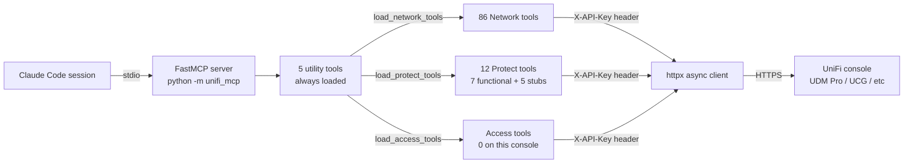
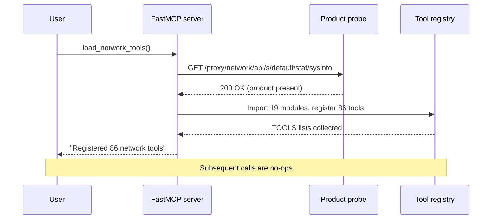
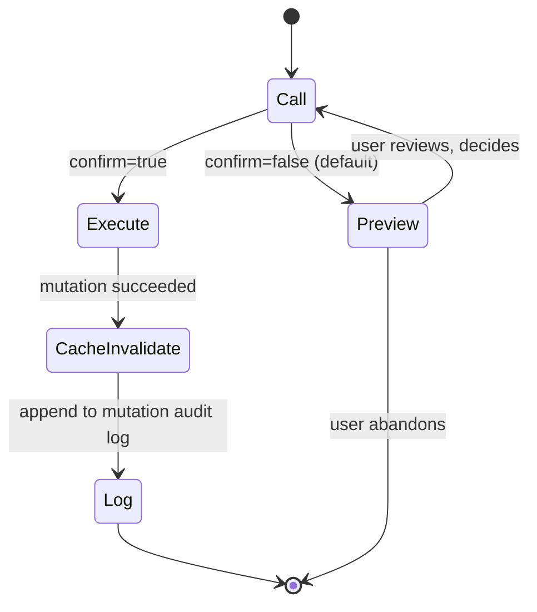

# unifi-mcp

An MCP server for UniFi Network and Protect, built on FastMCP and httpx. API-key-only auth, lazy loading per product, and a preview-confirm safety model for destructive operations.

## What this is

A 103-tool MCP server (with Network and Protect loaded) for UniFi Network and Protect. Tools load on demand per product, so the token budget stays small until you need a capability. All mutations require a two-step preview-confirm flow before any API call is made. Authentication uses the X-API-Key header only (local-console keys, not cloud keys).

## Table of Contents

1. [Install via Plugin](#install-via-plugin)
2. [Install Manually](#install-manually)
3. [Prerequisites](#prerequisites)
4. [API Key Walkthrough](#api-key-walkthrough)
5. [Environment Variables](#environment-variables)
6. [Architecture](#architecture)
7. [Tool Inventory](#tool-inventory)
8. [Lazy Loading](#lazy-loading)
9. [Safety Model](#safety-model)
10. [Auth Discovery](#auth-discovery)
11. [Troubleshooting](#troubleshooting)
12. [Development](#development)
13. [Attribution](#attribution)
14. [License](#license)

---

## Install via Plugin

The recommended path for most users. No cloning, no manual config edits.

```
/plugin marketplace add chris2ao/unifi-mcp
/plugin install unifi-mcp@chris2ao
```

After install, export the two required environment variables in your shell profile (see [Prerequisites](#prerequisites) and [API Key Walkthrough](#api-key-walkthrough) for details):

```bash
export UNIFI_HOST="https://192.168.1.1"
export UNIFI_API_KEY="<your-local-console-key>"
```

The `plugin.json` declares `"env": {}`, so the MCP process inherits these from the launching shell. Restart your Claude Code session after setting them.

Verify the plugin is registered:

```
/plugin list
```

Then confirm the server responds in a session:

```
> Call get_server_info
```

### Plugin vs Manual Trade-offs

| | Plugin | Manual |
|---|---|---|
| Setup effort | Two commands | Clone + config edit |
| Updates | Automatic via marketplace | Pin to a branch or tag yourself |
| Hacking on the code | Not suitable | Full source access |
| Config location | Managed by plugin system | `~/.claude.json` mcpServers block |
| Good for | Most users | Contributors, power users |

---

## Install Manually

For contributors or users who want to pin to a specific branch.

**Step 1.** Clone and install dependencies:

```bash
git clone https://github.com/chris2ao/unifi-mcp
cd unifi-mcp && uv sync
```

**Step 2.** Export environment variables in your shell profile or a sourced secrets file (e.g., `~/.claude/secrets/secrets.env` sourced from `~/.zshrc`):

```bash
export UNIFI_HOST="https://192.168.1.1"
export UNIFI_API_KEY="<your-local-console-key>"
```

**Step 3.** Add the server to `~/.claude.json` under `mcpServers`:

```json
"unifi": {
  "command": "uv",
  "args": [
    "run",
    "--directory",
    "/absolute/path/to/unifi-mcp",
    "python",
    "-m",
    "unifi_mcp"
  ],
  "env": {}
}
```

The empty `"env": {}` block causes the MCP process to inherit environment variables from the shell that launched Claude Code, where `UNIFI_HOST` and `UNIFI_API_KEY` are already set.

---

## Prerequisites

- **Python 3.12 or newer** on PATH. Check: `python3 --version`.
- **uv** package manager.
  - macOS: `brew install uv`
  - Linux: `curl -LsSf https://astral.sh/uv/install.sh | sh`
- **Claude Code CLI or Claude Desktop** (either works).
- **Network reachability** to the UniFi console over HTTPS on its local IP. The server does not support routing through `unifi.ui.com`.
- **UDM Pro, UDR, UDW, UCG, or UniFi Cloud Key** running UniFi OS 4.0 or later. The Integrations > API Keys feature requires OS 4.0+.
- **Local-console admin privileges** to create the API key.

---

## API Key Walkthrough

These steps are verified against UDM Pro running UniFi OS 5.0.16. The UI may differ slightly on older versions.

1. Open your UniFi console in a browser at its **local** IP address (for example, `https://192.168.1.1`). Do **not** use `unifi.ui.com`. Cloud-routed sessions cannot authenticate against the local API surface, and cloud keys will return 401 on every request.

2. Log in as an admin user.

3. Click the **console-device pill** at the top of the sidebar. On a UDM Pro, this reads "UDM Pro" with a small device icon. Clicking it opens the console settings overlay.

4. Navigate to **Settings > Control Plane > Integrations**.

5. Click **Create API Key**.

6. Give the key a name. The suggestion `claude-code-mcp` is descriptive and easy to identify later. Set an expiration (or choose "never"). Click **Save**.

7. Copy the generated key **immediately**. The UI shows it only once. If you close the dialog without copying, delete the key and create a new one.

8. Add the key to your shell profile or to `~/.claude/secrets/secrets.env`:

   ```bash
   export UNIFI_HOST="https://192.168.1.1"
   export UNIFI_API_KEY="<paste-here>"
   ```

9. Restart your Claude Code session so the environment is picked up by the MCP process.

**Why local, not cloud?**

This server targets the Network application at `/proxy/network/*` and the Protect Integration API at `/proxy/protect/integration/v1/*`. Both path prefixes accept the `X-API-Key` header from local-console keys. Cloud keys (issued by `unifi.ui.com`) are not forwarded to these paths and return 401. There is no workaround. You must use a local-console key.

---

## Environment Variables

| Variable | Required | Default | Description |
|---|---|---|---|
| `UNIFI_HOST` | Yes | | Console URL, local IP only (e.g., `https://192.168.1.1`) |
| `UNIFI_API_KEY` | Yes | | API key from Settings > Control Plane > Integrations |
| `UNIFI_SITE` | No | `default` | UniFi site name |
| `UNIFI_VERIFY_SSL` | No | `false` | SSL certificate verification. Set to `false` for self-signed console certs (the default for most installations) |

---

## Architecture



The server starts with exactly 5 tools registered. Calling a loader tool probes the console, imports the relevant modules, and registers the tools for that product. Subsequent calls to the same loader are a no-op. The httpx client attaches `X-API-Key: <value>` to every request and SSL verification is off by default (self-signed certs).

---

## Tool Inventory

### Utility Tools (5, always loaded)

These 5 tools are always available from session start. They do not require a loader call.

| Tool | Description |
|---|---|
| `load_network_tools` | Probe console, register 86 Network tools |
| `load_protect_tools` | Probe console, register 12 Protect tools (7 functional, 5 stubs) |
| `load_access_tools` | Probe console, register Access tools (0 on consoles without Access) |
| `get_auth_report` | View in-session API request log: endpoints, status codes, success rate |
| `get_server_info` | Server version, loaded products, current tool count |

### Network Tools (86, loaded via `load_network_tools`)

| Category | Count | Tools |
|---|---|---|
| Devices | 12 | list, get, restart, adopt, forget, locate, RF scan, firmware upgrade, rename, stats, ports, uplinks |
| Clients | 8 | list active, get, block, unblock, reconnect, alias, list all (historical), usage history |
| Networks/VLANs | 6 | list, get, create, update, delete, DHCP leases |
| Legacy Firewall | 8 | list rules, create, update, delete, reorder, list groups, create group, delete group |
| Zone-Based Firewall | 6 | list zones, get zone, list policies, create policy, update policy, delete policy |
| WiFi/SSID | 6 | list, create, update, delete, stats, toggle |
| VPN | 2 | list servers, list clients |
| Port Forwarding | 4 | list, create, update, delete |
| DPI | 2 | site-wide stats, per-client breakdown |
| Hotspot | 2 | list vouchers, create voucher |
| MAC ACL | 3 | list filter rules, add filter, delete filter |
| QoS | 2 | list rules, bandwidth profiles |
| Topology | 3 | graph (nodes + edges), uplink tree, port table |
| Traffic Flows | 4 | list flows, top talkers, filter by app, filter by client |
| RADIUS | 4 | list profiles, create, update, delete |
| Port Profiles | 4 | list, create, update, delete (with PoE) |
| Backups | 3 | list, create, restore |
| Webhooks | 3 | list, create, delete |
| System | 4 | sysinfo, health, alarms, events |
| **Total** | **86** | |

**Note on Traffic Flows:** On Network 10.2.105, all 4 `traffic_flows` tools return `PRODUCT_UNAVAILABLE`. The Integration API does not expose per-flow data on this firmware. Use `list_clients` for per-client byte counters instead.

### Protect Tools (12, loaded via `load_protect_tools`)

| Tool | Status | Notes |
|---|---|---|
| `list_cameras` | Functional | Returns all cameras on the NVR |
| `get_camera` | Functional | Single camera by ID with full config |
| `get_camera_snapshot` | Functional | Returns base64-encoded JPEG |
| `list_liveviews` | Functional | Configured live view layouts |
| `list_nvrs` | Functional | NVR device list |
| `get_nvr_stats` | Functional | Storage, recording status, uptime |
| `update_camera_name` | Functional | Tier-1 mutation (executes immediately, no confirm step) |
| `set_camera_recording_mode` | PRODUCT_UNAVAILABLE stub | Endpoint absent in Protect 7.0.104 via Integration API |
| `ptz_camera` | PRODUCT_UNAVAILABLE stub | Endpoint absent in Protect 7.0.104 via Integration API |
| `reboot_camera` | PRODUCT_UNAVAILABLE stub | Endpoint absent in Protect 7.0.104 via Integration API |
| `list_motion_events` | PRODUCT_UNAVAILABLE stub | Endpoint absent in Protect 7.0.104 via Integration API |
| `list_smart_detections` | PRODUCT_UNAVAILABLE stub | Endpoint absent in Protect 7.0.104 via Integration API |

The 5 stubs are registered and callable. Each returns a structured error envelope that names the exact Integration API endpoint that failed probing on Protect 7.0.104. When UniFi ships these endpoints in a future firmware, the `no network call` assertion tests will fail, surfacing the stubs for implementation.

### Access Tools

Access tools are architecture stubs. The loader probes the console and reports the product as unavailable on consoles without Access hardware installed. No tools register on a UDM Pro.

### Tool Count by Load State

| State | Tools in Context |
|---|---|
| Startup (utility only) | 5 |
| After `load_network_tools` | 91 |
| After `load_protect_tools` | 103 (on UDM Pro with Protect) |
| After `load_access_tools` | 103 (no Access hardware on test console) |

For reference documentation on all endpoints, see [docs/API.md](docs/API.md). For the security review, see [docs/SECURITY_REVIEW.md](docs/SECURITY_REVIEW.md).

---

## Lazy Loading

The server registers only the 5 utility tools at startup. This keeps the token budget small when you only need a subset of capabilities.



If the probe returns a non-200 status (product absent, network unreachable, wrong URL), the loader returns a clear error and registers no tools. Nothing breaks in the session; you just cannot use those tools.

---

## Safety Model

Tools are classified into two tiers. Tier 1 executes immediately. Tier 2 requires an explicit confirm step before any API call is made.



### Tier 1 (execute immediately, no confirm step)

Read operations (list, get, stats, topology, traffic flows), cosmetic mutations (rename, alias), and non-destructive actions (locate LED, reconnect client, create voucher, create backup, `update_camera_name`).

### Tier 2 (preview first, then confirm=True to execute)

| Category | Operations |
|---|---|
| Networks/VLANs | create, update, delete |
| Legacy Firewall | create rule, update rule, delete rule, reorder rules, create group, delete group |
| Zone-Based Firewall | create policy, update policy, delete policy |
| Devices | restart, forget, firmware upgrade |
| Clients | block, unblock |
| WiFi/SSID | create, update, delete |
| Port Forwarding | create, update, delete |
| RADIUS | create, update, delete |
| Port Profiles | create, update, delete |
| Backups | restore |

**How it works:**

1. Call the tool with `confirm=False` (the default). The server validates the parameters and builds the API payload. It returns a human-readable preview showing exactly what will be sent to the UniFi API. No HTTP request is made.
2. Review the preview in the Claude response.
3. Call the same tool again with `confirm=True`. The server verifies that a matching preview exists in the session state, executes the mutation, and invalidates the relevant cache entry.

The full tier classification is in `src/unifi_mcp/safety.py`.

---

## Auth Discovery

Every HTTP request the server makes is logged to an in-memory discovery registry. Each entry records the endpoint path, HTTP method, response status code, and timestamp.

Call `get_auth_report` at any time to see:

- **Summary:** Total requests made this session, success count, failure count, success rate as a percentage.
- **Auth failures:** Endpoints that returned 401 or 403, indicating the API key was rejected or lacked permission.
- **Full log:** The complete ordered list of every request made during the session.

This report is useful for diagnosing auth problems without enabling server-side debug logging. If you see a 401 in the failures list, the most common cause is using a cloud key instead of a local-console key (see [API Key Walkthrough](#api-key-walkthrough)).

---

## Troubleshooting

**"Cannot reach UniFi console" / connection refused / timeout**

Verify `UNIFI_HOST` is the LAN IP of the console, not a hostname that only resolves on the console's local network or a VPN you are not currently connected to. The value must be reachable over HTTPS from the machine running Claude Code.

**401 on every request / API key rejected**

You are using a cloud key issued by `unifi.ui.com`. Cloud keys do not authenticate against `/proxy/network/*` or `/proxy/protect/integration/v1/*`. Delete the cloud key, follow the [API Key Walkthrough](#api-key-walkthrough), and create a local-console key at Settings > Control Plane > Integrations on the console's local web UI.

**"PATCH returned AJV_PARSE_ERROR"**

Protect 7.0.104 schema validation rejects unknown properties in PATCH bodies. Only send fields that appear in the output of `get_camera`. Do not pass fields you are not explicitly changing.

**`load_protect_tools` returns "not installed" or "product unavailable"**

Either Protect is not installed on this console, or the probe endpoint `/proxy/protect/integration/v1/meta/info` is not reachable. Older Protect firmware (before the Integration API was introduced) will fail the probe. Upgrade Protect, or accept that Protect tools are not available on this console.

**`set_camera_recording_mode`, `reboot_camera`, or `ptz_camera` return PRODUCT_UNAVAILABLE**

This is expected behavior on Protect 7.0.104. The Integration API does not expose these operations via API key on current firmware. Use the Protect web or mobile UI for these actions. The stubs will be implemented when UniFi ships the corresponding API endpoints in a future firmware release.

**Traffic flow tools return PRODUCT_UNAVAILABLE**

Per-flow data is not exposed by the Integration API on Network 10.2.105. Use `list_clients` to get per-client byte counters (rx_bytes, tx_bytes fields). The traffic flow tools remain registered and will be updated when the API surface expands.

**Environment variables not picked up by the MCP server**

The `"env": {}` block in the config inherits from the launching shell. If you added the variables to `~/.zshrc` or a sourced file, restart Claude Code from a shell that has sourced the file. You can verify the variables are set by running `echo $UNIFI_HOST && echo $UNIFI_API_KEY` in a new terminal before launching.

---

## Development

### Running Tests

```bash
# Unit tests only (no console required)
uv run pytest

# With coverage report
uv run pytest --cov

# Integration tests (requires live console and env vars set)
uv run pytest -m integration
```

Current status: 208 unit tests passing, 15 skipped integration tests.

### Coverage Target

The project targets 80% unit test coverage on infrastructure modules (auth, cache, safety, registry, config). Coverage enforcement is configured in `pyproject.toml`.

### Project Structure

```
src/unifi_mcp/
  __main__.py         # Entry point for python -m unifi_mcp
  server.py           # FastMCP app, loader and utility tools
  config.py           # Pydantic settings from env vars
  errors.py           # Structured error categories
  cache.py            # In-memory TTL cache with mutation invalidation
  safety.py           # Tier classification, preview-confirm flow, audit log
  auth/
    client.py         # httpx async client with X-API-Key header injection
    discovery.py      # In-session auth discovery registry
  tools/
    _registry.py      # Lazy loader: per-product deferred import
    network/          # 19 modules, 86 tools
    protect/          # 12 tools (7 functional + 5 stubs)
    access/           # Stubs, 0 tools on current console
tests/
  unit/               # 208 tests, no console required
  integration/        # 15 tests, require live console and env vars
docs/
  plans/              # Implementation plans, audit reports, design specs
  API.md              # Endpoint catalog
  SECURITY_REVIEW.md  # Security audit report
```

**Runtime:** Python 3.12+, managed with uv. Entry point is `python -m unifi_mcp`.

**Tested console:** UDM Pro, UniFi OS 5.0.16, Network 10.2.105, Protect 7.0.104.

---

## Attribution

This project draws from the work of two open-source UniFi MCP servers:

- **[sirkirby/unifi-mcp](https://github.com/sirkirby/unifi-mcp)** (MIT License): Primary reference for Network, Protect, and Access API surface, tool patterns, safety model, and lazy loading architecture.
- **[enuno/unifi-mcp-server](https://github.com/enuno/unifi-mcp-server)** (Apache 2.0 License): Primary reference for Zone-Based Firewall, traffic flow monitoring, network topology mapping, RADIUS/802.1X, port profiles with PoE, scheduled backups, and webhooks. Also the reference for the httpx-native API-key auth pattern.

Both projects are credited in the [LICENSE](LICENSE) file.

---

## License

[MIT](LICENSE)
