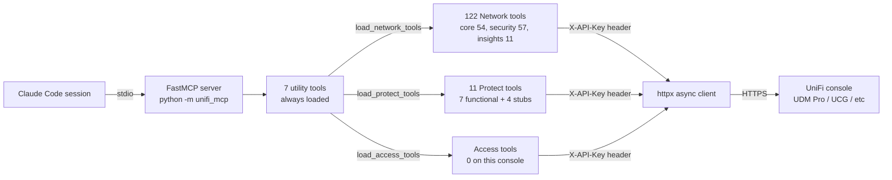
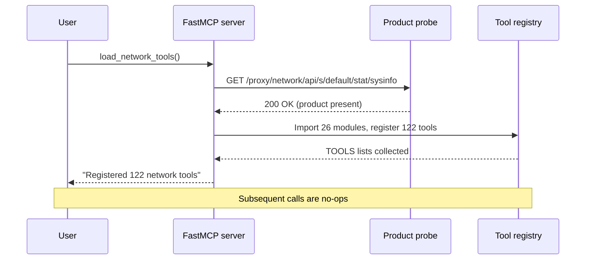
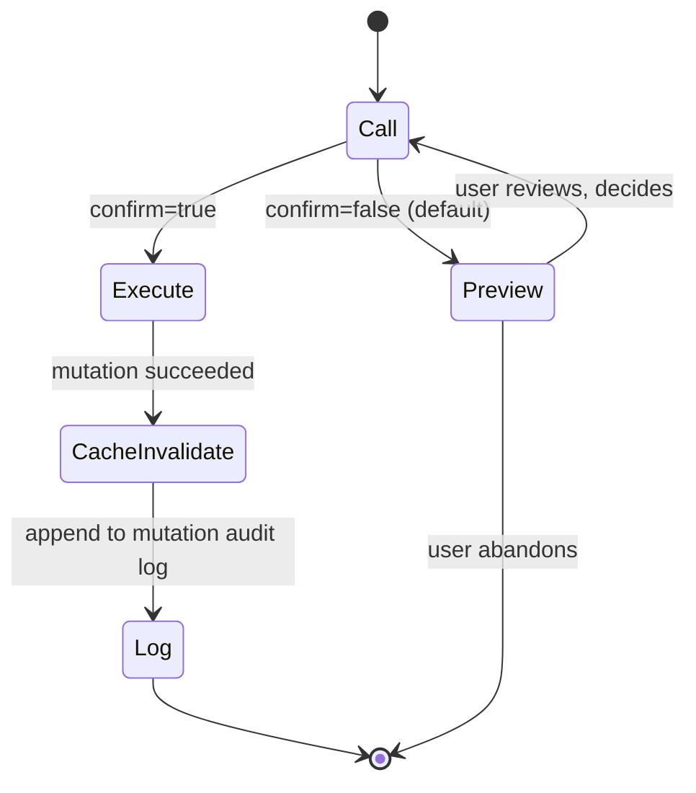

# unifi-mcp

[](https://github.com/chris2ao/unifi-mcp/actions/workflows/test.yml)
[](./LICENSE)
[](https://www.python.org/downloads/)
[](https://modelcontextprotocol.io/)
[](https://ui.com/)

An MCP server for UniFi Network and Protect, built on FastMCP and httpx. API-key-only auth, lazy loading per product, and a preview-confirm safety model for destructive operations.

## What this is

A 140-tool MCP server (7 always-loaded tools, 122 Network and 11 Protect, with everything loaded) for UniFi Network and Protect. Tools load on demand per product and per group, so the token budget stays small until you need a capability. The full per-tool list with tiers is in [docs/TOOLS.md](docs/TOOLS.md). All mutations require a two-step preview-confirm flow before any API call is made. Authentication uses the X-API-Key header only (local-console keys, not cloud keys).

## Table of Contents

1. [Install via Plugin](#install-via-plugin)
2. [Install Manually](#install-manually)
3. [Prerequisites](#prerequisites)
4. [API Key Walkthrough](#api-key-walkthrough)
5. [Environment Variables](#environment-variables)
6. [Architecture](#architecture)
7. [Tool Inventory](#tool-inventory)
8. [Lazy Loading](#lazy-loading)
9. [Safety Model](#safety-model)
10. [Auth Discovery](#auth-discovery)
11. [Troubleshooting](#troubleshooting)
12. [Development](#development)
13. [Attribution](#attribution)
14. [License](#license)

---

## Install via Plugin

The recommended path for most users. No cloning, no manual config edits.

```
/plugin marketplace add chris2ao/unifi-mcp
/plugin install unifi-mcp@chris2ao
```

After install, export the two required environment variables in your shell profile (see [Prerequisites](#prerequisites) and [API Key Walkthrough](#api-key-walkthrough) for details):

```bash
export UNIFI_HOST="https://192.168.1.1"
export UNIFI_API_KEY="<your-local-console-key>"
```

The `plugin.json` declares `"env": {}`, so the MCP process inherits these from the launching shell. Restart your Claude Code session after setting them.

Verify the plugin is registered:

```
/plugin list
```

Then confirm the server responds in a session:

```
> Call get_server_info
```

### Plugin vs Manual Trade-offs

| | Plugin | Manual |
|---|---|---|
| Setup effort | Two commands | Clone + config edit |
| Updates | Automatic via marketplace | Pin to a branch or tag yourself |
| Hacking on the code | Not suitable | Full source access |
| Config location | Managed by plugin system | `~/.claude.json` mcpServers block |
| Good for | Most users | Contributors, power users |

---

## Install Manually

For contributors or users who want to pin to a specific branch.

**Step 1.** Clone and install dependencies:

```bash
git clone https://github.com/chris2ao/unifi-mcp
cd unifi-mcp && uv sync
```

**Step 2.** Export environment variables in your shell profile or a sourced secrets file (e.g., `~/.claude/secrets/secrets.env` sourced from `~/.zshrc`):

```bash
export UNIFI_HOST="https://192.168.1.1"
export UNIFI_API_KEY="<your-local-console-key>"
```

**Step 3.** Add the server to `~/.claude.json` under `mcpServers`:

```json
"unifi": {
  "command": "uv",
  "args": [
    "run",
    "--directory",
    "/absolute/path/to/unifi-mcp",
    "python",
    "-m",
    "unifi_mcp"
  ],
  "env": {}
}
```

The empty `"env": {}` block causes the MCP process to inherit environment variables from the shell that launched Claude Code, where `UNIFI_HOST` and `UNIFI_API_KEY` are already set.

---

## Prerequisites

- **Python 3.12 or newer** on PATH. Check: `python3 --version`.
- **uv** package manager.
  - macOS: `brew install uv`
  - Linux: `curl -LsSf https://astral.sh/uv/install.sh | sh`
- **Claude Code CLI or Claude Desktop** (either works).
- **Network reachability** to the UniFi console over HTTPS on its local IP. The server does not support routing through `unifi.ui.com`.
- **UDM Pro, UDR, UDW, UCG, or UniFi Cloud Key** running UniFi OS 4.0 or later. The Integrations > API Keys feature requires OS 4.0+.
- **Local-console admin privileges** to create the API key.

---

## API Key Walkthrough

These steps are verified against UDM Pro running UniFi OS 5.0.16. The UI may differ slightly on older versions.

1. Open your UniFi console in a browser at its **local** IP address (for example, `https://192.168.1.1`). Do **not** use `unifi.ui.com`. Cloud-routed sessions cannot authenticate against the local API surface, and cloud keys will return 401 on every request.

2. Log in as an admin user.

3. Click the **console-device pill** at the top of the sidebar. On a UDM Pro, this reads "UDM Pro" with a small device icon. Clicking it opens the console settings overlay.

4. Navigate to **Settings > Control Plane > Integrations**.

5. Click **Create API Key**.

6. Give the key a name. The suggestion `claude-code-mcp` is descriptive and easy to identify later. Set an expiration (or choose "never"). Click **Save**.

7. Copy the generated key **immediately**. The UI shows it only once. If you close the dialog without copying, delete the key and create a new one.

8. Add the key to your shell profile or to `~/.claude/secrets/secrets.env`:

   ```bash
   export UNIFI_HOST="https://192.168.1.1"
   export UNIFI_API_KEY="<paste-here>"
   ```

9. Restart your Claude Code session so the environment is picked up by the MCP process.

**Why local, not cloud?**

This server targets the Network application at `/proxy/network/*` and the Protect Integration API at `/proxy/protect/integration/v1/*`. Both path prefixes accept the `X-API-Key` header from local-console keys. Cloud keys (issued by `unifi.ui.com`) are not forwarded to these paths and return 401. There is no workaround. You must use a local-console key.

---

## Environment Variables

| Variable | Required | Default | Description |
|---|---|---|---|
| `UNIFI_HOST` | Yes | | Console URL, local IP only (e.g., `https://192.168.1.1`) |
| `UNIFI_API_KEY` | Yes | | API key from Settings > Control Plane > Integrations |
| `UNIFI_SITE` | No | `default` | UniFi site name |
| `UNIFI_VERIFY_SSL` | No | `false` | SSL certificate verification. Set to `false` for self-signed console certs (the default for most installations) |
| `UNIFI_TOOL_GROUPS` | No | unset (all groups) | Default tool groups for the loaders, comma separated, for example `network:core,network:security,protect:cameras`. A product that is not mentioned loads all of its groups |
| `UNIFI_PREVIEW_TTL_SECONDS` | No | `600` | How long a Tier 2 preview stays valid for the confirm call (1 to 86400) |

---

## Architecture


```mermaid
flowchart LR
    CC[Claude Code session] -->|stdio| MCP[FastMCP server<br/>python -m unifi_mcp]
    MCP --> UT[7 utility tools<br/>always loaded]
    UT -->|load_network_tools| NET[122 Network tools<br/>core 54, security 57, insights 11]
    UT -->|load_protect_tools| PROT[11 Protect tools<br/>7 functional + 4 stubs]
    UT -->|load_access_tools| ACC[Access tools<br/>0 on this console]
    NET & PROT & ACC -->|X-API-Key header| HC[httpx async client]
    HC -->|HTTPS| UNIFI[UniFi console<br/>UDM Pro / UCG / etc]
```

The server starts with exactly 7 tools registered. Calling a loader tool probes the console, imports the relevant modules, and registers the tools for that product (all groups, or only the groups you ask for). Tool modules are auto-discovered: any module under `tools/<product>/` that exports `TOOLS` is loaded. Calling a loader again only adds tools from groups that are not loaded yet. The httpx client attaches `X-API-Key: <value>` to every request and SSL verification is off by default (self-signed certs).

---

## Tool Inventory

### Utility Tools (7, always loaded)

These 7 tools are always available from session start. They do not require a loader call.

| Tool | Description |
|---|---|
| `load_network_tools` | Probe console, register Network tools (all groups, or `groups=["core", ...]`) |
| `load_protect_tools` | Probe console, register Protect tools (all groups, or `groups=["cameras", ...]`) |
| `load_access_tools` | Probe console, register Access tools (0 on consoles without Access) |
| `list_tool_groups` | Groups, modules, tool counts and loaded state per product (no console call) |
| `get_auth_report` | View in-session API request log: endpoints, status codes, success rate |
| `get_server_info` | Server version, loaded products and groups, console firmware versions and drift from the tested versions |
| `get_mutation_log` | Audit log of confirmed Tier 2 changes in this session |

### Network Tools (122, loaded via `load_network_tools`)

Groups: `core` (54 tools), `security` (57), `insights` (11). The full per-tool list is in [docs/TOOLS.md](docs/TOOLS.md); parameters and return shapes are in [docs/API.md](docs/API.md).

| Category | Count | Tools |
|---|---|---|
| Devices | 16 | list, get, restart, adopt, forget, locate, RF scan, firmware upgrade, rename, stats, ports, uplinks, statistics, details (v1), pending devices, PoE port power cycle |
| Clients | 8 | list active, get, block, unblock, reconnect, alias, list all (historical), usage history |
| Networks/VLANs | 7 | list, get, create, update, delete, DHCP leases, references |
| Legacy Firewall | 8 | list rules, create, update, delete, reorder, list groups, create group, delete group |
| Zone-Based Firewall | 15 | zones, policies (v2 and official API), toggle, logging, ordering, reorder, custom zones |
| DNS Policies | 5 | list, get, create, update, delete (A, AAAA, CNAME, MX, TXT, SRV, forward domain) |
| Traffic Matching Lists | 5 | list, get, create, update, delete (IP and port lists) |
| Traffic Rules | 6 | list, get, create, update, delete, toggle |
| WiFi/SSID | 6 | list, create, update, delete, stats, toggle |
| VPN | 2 | list servers, list clients |
| Port Forwarding | 4 | list, create, update, delete |
| DPI | 2 | site-wide stats, per-client breakdown |
| Hotspot | 2 | list vouchers, create voucher |
| MAC ACL | 3 | list filter rules, add filter, delete filter |
| QoS | 2 | list rules, bandwidth profiles |
| Topology | 3 | graph (nodes + edges), uplink tree, port table |
| Traffic Flows | 6 | list flows, top talkers, filter by app, filter by client, blocked flows, flow summary |
| Insights | 3 | dashboard summary, speed test history, WAN status |
| RADIUS | 4 | list profiles, create, update, delete |
| Port Profiles | 4 | list, create, update, delete (with PoE) |
| Backups | 3 | list, create, restore |
| Webhooks | 3 | stubs, return PRODUCT_UNAVAILABLE (endpoint removed in Network 10.6) |
| System | 5 | sysinfo, health, alarms, events, event counts |
| **Total** | **122** | |

**Note on Traffic Flows:** The flow tools use the v2 query endpoint verified on Network 10.6.106. The console returns flows unordered and caps totals at 10,000, so results are a sample (sorted newest first) and the aggregate tools report `truncated`.

**Note on ZBF ids:** Integration API policy ids are UUIDs and differ from the v2 `_id` values returned by `list_zbf_policies`. Use `list_zbf_policies_v1` to get ids for the official ZBF tools.

### Protect Tools (11, loaded via `load_protect_tools`)

Groups: `cameras` (8 tools), `devices` (3 tools).

| Tool | Status | Notes |
|---|---|---|
| `list_cameras` | Functional | Returns all cameras on the NVR |
| `get_camera` | Functional | Single camera by ID with full config |
| `get_camera_snapshot` | Functional | Returns base64-encoded JPEG |
| `list_liveviews` | Functional | Configured live view layouts |
| `list_nvrs` | Functional | NVR device list |
| `get_nvr_stats` | Functional | Storage, recording status, uptime |
| `update_camera_name` | Functional | Tier-1 mutation (executes immediately, no confirm step) |
| `set_camera_recording_mode` | PRODUCT_UNAVAILABLE stub | No recording-mode field in the Integration API (Protect 7.2.105, spec 7.3.70) |
| `reboot_camera` | PRODUCT_UNAVAILABLE stub | No reboot endpoint in the Integration API (Protect 7.2.105, spec 7.3.70) |
| `list_motion_events` | PRODUCT_UNAVAILABLE stub | Endpoint absent in Protect 7.0.104 via Integration API |
| `list_smart_detections` | PRODUCT_UNAVAILABLE stub | Endpoint absent in Protect 7.0.104 via Integration API |

The 4 stubs are registered and callable. Each returns a structured error envelope that explains why the operation is unavailable. When UniFi ships these endpoints in a future firmware, the `no network call` assertion tests will fail, surfacing the stubs for implementation.

### Access Tools

Access tools are architecture stubs. The loader probes the console and reports the product as unavailable on consoles without Access hardware installed. No tools register on a UDM Pro.

### Tool Count by Load State

| State | Tools in Context |
|---|---|
| Startup (utility only) | 7 |
| After `load_network_tools(groups=["core"])` | 61 |
| After `load_network_tools` (all groups) | 129 |
| After `load_protect_tools` (all groups) | 140 (on a console with Protect) |
| After `load_access_tools` | 140 (no Access hardware on test console) |

### OpenAPI Coverage

Official-endpoint coverage from `scripts/spec_coverage.py` against the vendored specs in `docs/specs/` (path match only, not HTTP method):

| Spec | Version | Operations covered |
|---|---|---|
| UniFi Network Integration API | 10.6.106 | 46.6% (34 of 73) |
| UniFi Protect Integration API | 7.3.70 | 10.8% (8 of 74) |
| UniFi Site Manager API | 1.0.0 | 0% (0 of 14, no cloud tools in this release) |

Run `uv run python scripts/spec_diff.py` after a firmware upgrade to see what changed upstream. See [docs/SPEC_MAINTENANCE.md](docs/SPEC_MAINTENANCE.md).

For reference documentation on all endpoints, see [docs/API.md](docs/API.md). For the security review, see [docs/SECURITY_REVIEW.md](docs/SECURITY_REVIEW.md).

---

## Lazy Loading

The server registers only the 7 utility tools at startup. This keeps the token budget small when you only need a subset of capabilities. Loaders also work per group, so you can register just what a session needs.


```mermaid
sequenceDiagram
    participant User
    participant MCP as FastMCP server
    participant Probe as Product probe
    participant Tools as Tool registry
    User->>MCP: load_network_tools()
    MCP->>Probe: GET /proxy/network/api/s/default/stat/sysinfo
    Probe-->>MCP: 200 OK (product present)
    MCP->>Tools: Import 26 modules, register 122 tools
    Tools-->>MCP: TOOLS lists collected
    MCP-->>User: "Registered 122 network tools"
    Note over User,Tools: Subsequent calls are no-ops
```

If the probe returns a non-200 status (product absent, network unreachable, wrong URL), the loader returns a clear error and registers no tools. Nothing breaks in the session; you just cannot use those tools.

### Tool groups

| Product | Group | Contents |
|---|---|---|
| Network | `core` | System, devices, clients, networks, WiFi, topology, backups, hotspot, port profiles |
| Network | `security` | Firewall, zone-based firewall, DNS policies, traffic matching lists, MAC ACL, RADIUS, port forwarding, traffic rules, QoS, VPN, webhooks |
| Network | `insights` | DPI, traffic flows, dashboard summary, speed tests, WAN status |
| Protect | `cameras` | Cameras, events, live views |
| Protect | `devices` | NVRs |

```
load_network_tools(groups=["core"])               # 54 tools
load_network_tools(groups=["core", "security"])   # registers only the 57 new ones
load_network_tools(groups=["all"])                # everything not yet loaded
```

`"network:core"` is accepted as well as `"core"`. Calls are incremental: reloading a group is a no-op and only new tools register. Call `list_tool_groups` to see groups, tool counts and what is loaded. To set a default without passing `groups` each time, export `UNIFI_TOOL_GROUPS`:

```bash
export UNIFI_TOOL_GROUPS="network:core,network:security,protect:cameras"
```

Unset means every group. A product that is not mentioned in the variable loads all of its groups. An invalid entry stops the server at startup with a message naming it.

---

## Safety Model

Tools are classified into two tiers. Tier 1 executes immediately. Tier 2 requires an explicit confirm step before any API call is made.


```mermaid
stateDiagram-v2
    [*] --> Call
    Call --> Preview : confirm=false (default)
    Preview --> Call : user reviews, decides
    Call --> Execute : confirm=true
    Execute --> CacheInvalidate : mutation succeeded
    CacheInvalidate --> Log : append to mutation audit log
    Log --> [*]
    Preview --> [*] : user abandons
```

### Tier 1 (execute immediately, no confirm step)

Read operations (list, get, stats, topology, traffic flows, insights), cosmetic mutations (rename, alias), and non-destructive actions (locate LED, reconnect client, create voucher, create backup, `update_camera_name`).

### Tier 2 (preview first, then confirm=True to execute)

| Category | Operations |
|---|---|
| Networks/VLANs | create, update, delete |
| Legacy Firewall | create rule, update rule, delete rule, reorder rules, create group, delete group |
| Zone-Based Firewall | create policy, update policy, delete policy, toggle policy, set policy logging, reorder policies, create zone, update zone, delete zone |
| DNS Policies | create, update, delete |
| Traffic Matching Lists | create, update, delete |
| Devices | restart, forget, firmware upgrade, PoE port power cycle |
| Clients | block, unblock |
| WiFi/SSID | create, update, delete |
| Port Forwarding | create, update, delete |
| RADIUS | create, update, delete |
| Port Profiles | create, update, delete |
| Backups | restore |
| Traffic Rules | create, update, delete, toggle |

**How it works:**

1. Call the tool with `confirm=False` (the default). The server validates the parameters and builds the API payload. It returns a human-readable preview showing exactly what will be sent to the UniFi API. No HTTP request is made.
2. Review the preview in the Claude response.
3. Call the same tool again with `confirm=True`. The server verifies that a matching preview with identical parameters was produced within the preview TTL (`UNIFI_PREVIEW_TTL_SECONDS`, default 600 seconds), consumes it, executes the mutation, and invalidates the relevant cache entry. Without a matching preview the call returns `PREVIEW_REQUIRED` and nothing is sent. Confirmed changes are recorded in the audit log (`get_mutation_log`).

Tier 2 tools are declared by each tool module (`TIER2_TOOLS`) and merged with the legacy map in `src/unifi_mcp/safety.py`. A test checks that every tool with a `confirm` parameter is Tier 2. The generated list is in [docs/TOOLS.md](docs/TOOLS.md).

---

## Auth Discovery

Every HTTP request the server makes is logged to an in-memory discovery registry. Each entry records the endpoint path, HTTP method, response status code, and timestamp.

Call `get_auth_report` at any time to see:

- **Summary:** Total requests made this session, success count, failure count, success rate as a percentage.
- **Auth failures:** Endpoints that returned 401 or 403, indicating the API key was rejected or lacked permission.
- **Full log:** The complete ordered list of every request made during the session.

This report is useful for diagnosing auth problems without enabling server-side debug logging. If you see a 401 in the failures list, the most common cause is using a cloud key instead of a local-console key (see [API Key Walkthrough](#api-key-walkthrough)).

---

## Troubleshooting

**"Cannot reach UniFi console" / connection refused / timeout**

Verify `UNIFI_HOST` is the LAN IP of the console, not a hostname that only resolves on the console's local network or a VPN you are not currently connected to. The value must be reachable over HTTPS from the machine running Claude Code.

**401 on every request / API key rejected**

You are using a cloud key issued by `unifi.ui.com`. Cloud keys do not authenticate against `/proxy/network/*` or `/proxy/protect/integration/v1/*`. Delete the cloud key, follow the [API Key Walkthrough](#api-key-walkthrough), and create a local-console key at Settings > Control Plane > Integrations on the console's local web UI.

**"PATCH returned AJV_PARSE_ERROR"**

Protect schema validation rejects unknown properties in PATCH bodies. Only send fields that appear in the output of `get_camera`. Do not pass fields you are not explicitly changing.

**`load_protect_tools` returns "not installed" or "product unavailable"**

Either Protect is not installed on this console, or the probe endpoint `/proxy/protect/integration/v1/meta/info` is not reachable. Older Protect firmware (before the Integration API was introduced) will fail the probe. Upgrade Protect, or accept that Protect tools are not available on this console.

**`set_camera_recording_mode`, `reboot_camera`, or the webhook tools return PRODUCT_UNAVAILABLE**

This is expected behavior on the tested firmware (Protect 7.2.105, Network 10.6.106). The Integration API does not expose these operations via API key. Use the Protect or Network web or mobile UI for these actions. The stubs will be implemented when UniFi ships the corresponding API endpoints.

**`get_server_info` shows firmware `drift`**

The console reports a Network or Protect major.minor version that differs from the version this release was tested against (Network 10.6.106, Protect 7.2.105). Tools may still work. If something misbehaves, run `uv run python scripts/spec_diff.py` to compare the console's API spec with the vendored one.

**A loader says "Unknown ... tool group"**

Group names are `core`, `security` and `insights` for Network, and `cameras` and `devices` for Protect. Call `list_tool_groups` for the current list. Check `UNIFI_TOOL_GROUPS` if the error appears without a `groups` argument.

**A confirm call returns `PREVIEW_REQUIRED`**

Tier 2 tools only run after a preview with identical parameters. Call the tool with `confirm=False`, review the preview, then repeat the call with `confirm=True` within the preview TTL (default 600 seconds).

**Environment variables not picked up by the MCP server**

The `"env": {}` block in the config inherits from the launching shell. If you added the variables to `~/.zshrc` or a sourced file, restart Claude Code from a shell that has sourced the file. You can verify the variables are set by running `echo $UNIFI_HOST && echo $UNIFI_API_KEY` in a new terminal before launching.

---

## Development

### Running Tests

```bash
# Unit tests only (no console required)
uv run pytest

# With coverage report
uv run pytest --cov

# Integration tests (requires live console and env vars set)
uv run pytest -m integration
```

Current status: __TESTS__ tests passing, 19 skipped integration tests.

After changing tools, regenerate the tool list with `uv run python scripts/gen_tool_docs.py`. CI runs it with `--check` and fails when `docs/TOOLS.md` is stale.

### Coverage Target

The project targets 80% unit test coverage on infrastructure modules (auth, cache, safety, registry, config). Coverage enforcement is configured in `pyproject.toml`.

### Project Structure

```
src/unifi_mcp/
  __main__.py         # Entry point for python -m unifi_mcp
  server.py           # FastMCP app, loader and utility tools, preview guard
  config.py           # Pydantic settings from env vars
  validation.py       # Shared input validation helpers
  errors.py           # Structured error categories
  cache.py            # In-memory TTL cache with mutation invalidation
  safety.py           # Tier classification, preview-confirm flow, audit log
  auth/
    client.py         # httpx async client with X-API-Key header injection
    discovery.py      # In-session auth discovery registry
  tools/
    _registry.py      # Auto-discovery, tool groups, per-product loading
    network/          # 26 modules, 122 tools
    protect/          # 11 tools (7 functional + 4 stubs)
    access/           # Stubs, 0 tools on current console
scripts/
  spec_diff.py        # Diff live OpenAPI specs against docs/specs
  spec_coverage.py    # Official-endpoint coverage report
  gen_tool_docs.py    # Generates docs/TOOLS.md
tests/
  unit/               # __TESTS__ tests, no console required
  integration/        # 19 tests, require live console and env vars
docs/
  plans/              # Implementation plans, audit reports, design specs
  API.md              # Tool reference
  TOOLS.md            # Generated tool list (scripts/gen_tool_docs.py)
  SPEC_MAINTENANCE.md # Spec upgrade workflow
  specs/              # Vendored OpenAPI specs
  SECURITY_REVIEW.md  # Security audit report
```

**Runtime:** Python 3.12+, managed with uv. Entry point is `python -m unifi_mcp`.

**Tested firmware:** UniFi Network 10.6.106, UniFi Protect 7.2.105 (UDM Pro).

---

## Attribution

This project draws from the work of two open-source UniFi MCP servers:

- **[sirkirby/unifi-mcp](https://github.com/sirkirby/unifi-mcp)** (MIT License): Primary reference for Network, Protect, and Access API surface, tool patterns, safety model, and lazy loading architecture.
- **[enuno/unifi-mcp-server](https://github.com/enuno/unifi-mcp-server)** (Apache 2.0 License): Primary reference for Zone-Based Firewall, traffic flow monitoring, network topology mapping, RADIUS/802.1X, port profiles with PoE, scheduled backups, and webhooks. Also the reference for the httpx-native API-key auth pattern.

Both projects are credited in the [LICENSE](LICENSE) file.

---

## License

[MIT](LICENSE)
